# agent-platform-reference

Production-grade AI agent platform: per-role RBAC, guardrails, hybrid RAG on pgvector, two-phase mutation contract with human approval, and eval gates in CI. 18 services, one `make demo`, zero cost.

Full spec: [docs/SPEC.md](docs/SPEC.md). Working context for contributors (and Claude Code): [CLAUDE.md](CLAUDE.md).
Diagrams (system topology + one flow diagram per major interaction): [docs/ARCHITECTURE.md](docs/ARCHITECTURE.md).
How to actually run things on a resource-constrained laptop — short demo, RAG eval, mutation
approval, async jobs, killswitch, troubleshooting: [docs/RUNBOOK.md](docs/RUNBOOK.md).
Want to test just the agent without the full ~20-container stack (skip Langfuse, RabbitMQ,
ingestion, everything not needed for that one demo)? [docs/DEMO.md](docs/DEMO.md) — two minimal,
live-verified profiles (6 or 10 containers).
Advisory notes on what a real production deployment might optimize (not scheduled, not part of any
milestone's DoD): [docs/OPTIMIZATION.md](docs/OPTIMIZATION.md).

## Status

Under active implementation, milestone by milestone (§15 of the spec) — this is not yet the finished
demo the spec describes. `make demo` itself is still an intentionally-unimplemented guard (§27.2
reserves it for M9's polish pass); [docs/RUNBOOK.md](docs/RUNBOOK.md) is the current substitute —
copy-pasteable commands for every milestone's live behavior, scenario by scenario.

| Milestone | State | What exists |
|---|---|---|
| M0 — Foundation | ✅ done | `packages/contracts`, Postgres schemas + RLS (Alembic), infra `docker compose` stack |
| M1 — Minimal sync path | ✅ done | `model-router`, `agent-harness` (LangGraph, 1 node), `agent-gateway`, Kong+JWT — a JWT through Kong reaches an LLM and comes back with a matching trace in Langfuse |
| M2 — Quota & rate limiting | ✅ done | Kong `rate-limiting` (L1) + Redis token-bucket reserve/reconcile with an expired-reservation sweeper (L2, `gateway/quota.py`) — a tenant over quota gets `429` + `Retry-After`, other tenants are unaffected, reconciliation leaves the bucket at exactly the tokens actually used |
| M3 — RAG | ✅ done | `services/ingestion` (filesystem → chunk → embed → upsert, incremental content-hash sync, tombstoning), `services/retrieval` (§28.9 hybrid dense+sparse RRF search, Infinity rerank, ACL filtering), `agent-harness` `retrieve` node — a question answerable from an ingested doc gets a grounded answer with valid citations, and ACL (`grp_hr`) is enforced end-to-end through Kong |
| M4 — Guardrails | ✅ done | `agent-harness` `guardrails/` package — §9.1 input (size, Presidio PII redaction w/ custom Indonesian recognizers, prompt injection, off-topic) and §9.2 output (format validity, groundedness, PII leak redaction, YAML policy rules) checks wired into the LangGraph loop, every decision logged to `audit.guardrail_events` + `guardrail_events_total`; a broken guardrail check fails closed (`503`), never open |
| M5 — Tool-calling & mutations | ✅ done | `services/mock-business-api` (seed-backed HR/payroll actions, own auth/preview-token/idempotency), `agent-harness` `act` node — a bounded `respond`↔`act` tool-calling loop (§5.3/§8.4's two-phase `preview`→`execute` contract): readonly tools answer directly, `risk_level: high` mutations (e.g. >5 days' leave) stop at `awaiting_approval` and require a human decision via `POST /v1/approvals/{id}/decision`, replayed decisions execute exactly once (§23.2i) |
| M5b — RBAC & tool authorization | ✅ done | `services/mock-idp` (dev login + RFC 8693 token exchange), `agent-harness` `authz/` — §22.1's five-set intersection (`agent_profile.allowed_tools ∩ HARNESS_AUDIENCE-filtered manifest ∩ permissions ∩ allow_mutations ∩ ¬killswitch`) as a swappable `PolicyResolver` (ADR-008), computed once per run by a new `authorize` node and logged to `audit.authz_decisions`; a disallowed tool never reaches the model's schema (leakage-tested against the actual outgoing payload) and a `data_scope: self` violation is rejected, not silently corrected; `HARNESS_AUDIENCE=external` boots with only one deliberately public tool and sits on a Docker network that structurally cannot resolve `mock-business-api` (§21/ADR-011, proven via DNS lookup); `POST /v1/admin/killswitch/{tools\|agents}/{name}` disables a tool in seconds via Redis |
| M6 — Async path | ✅ done | `services/async-worker` (new — a job *executor*, calling `agent-harness`'s own `/internal/v1/runs`, never a second orchestrator), `POST /v1/agent/jobs`/`GET /v1/agent/jobs/{id}` (gateway) — §5.9's RabbitMQ topology (priority queues, zero-plugin backoff-ladder retry via a no-consumer holding queue, explicit DLQ routing on every dead-letter path), race-safe job claiming (§23.2f), a genuinely separate `async-pool` LiteLLM budget key (§6 L3) threaded into the real model call, and HMAC-signed webhook delivery on completion |
| M7 — Semantic cache | ✅ done | `agent-harness` `cache/` — Redis (`redis-stack-server`) vector KNN lookup keyed on `semcache:{tenant_id}:{agent_id}:{acl_hash}:{prompt_version}`, `acl_hash = sha256(sorted(acl_group_ids))`; a hit returns in zero LLM cost, a miss writes back only when every §10 condition holds (agent+tool `cacheable: true`, no mutation/personal-tool call, no guardrail flag or PII event); event-driven invalidation from `services/ingestion` on document change. Live-verified: cross-user hits sharing one ACL namespace, a differing ACL group missing the identical question (§26.2's "most important assertion in the whole demo"), a personal query never cached, and a real document edit invalidating its cached answer |
| M8 — Evaluation | ✅ done | `services/eval` — a CLI tool (`uv run python -m eval_service.{run,gate,report}`), never its own container. Six deterministic metrics (§13.3, no LLM — tool selection, mutation safety, citation validity, refusal appropriateness, capability leak, PII leakage) gate on every run; four Ragas-judged metrics (faithfulness, answer relevancy, context precision/recall) gate statistically (median-of-k, fixed-seed bootstrap CI vs. a stored baseline, absolute-floor tripwire). `_eval` debug bundle attached to responses only for `EVAL_TENANT_IDS` tenants via a dedicated `mock-idp` impersonation endpoint. A judge failure degrades gracefully per-item rather than crashing the run. Live-verified: a full 16-item smoke run correctly blocked on real findings, with the two zero-tolerance security metrics (mutation safety, PII leakage) passing cleanly; gating the same run twice produced a byte-identical verdict. `make eval-nightly-sample` (§13.9) is the "Full + 200 sampel trace produksi + citation_support" nightly-tier extra, as its own CLI: reads real traces back out of Langfuse's public API (never ClickHouse directly), scores with a new hand-rolled `citation_support` judge plus reference-free Ragas metrics, and writes the lowest-scoring N to a report for human review — never auto-added to the golden set |
| M9 — Production hardening | not started | |

## Architecture

Every service, the message broker, the model backends, and the internal/external network split
(§21/ADR-011) in one diagram — `agent-harness` sits on `hris_internal` (can reach
`mock-business-api`); `agent-harness-external` (a separate, off-by-default profile) structurally
cannot, proven by DNS resolution failing, not just a policy decision. The numbers (**①**–**⑥**) mark
the one synchronous request's path, in order — everything else (async, identity, ingestion,
observability, eval) is a side system, drawn with thin dotted connectors.

```mermaid
flowchart LR
    classDef startEnd fill:#2f855a,stroke:#1c4532,color:#fff,stroke-width:2px;
    classDef core fill:#2b6cb0,stroke:#1a365d,color:#fff,stroke-width:2px;
    classDef support fill:#718096,stroke:#2d3748,color:#fff;
    classDef store fill:#6b46c1,stroke:#44337a,color:#fff;

    Start(["① Client\nsends request"]):::startEnd
    Kong["② Kong :8000\nJWT verify + rate limit"]:::core
    Gateway["③ agent-gateway :8080\nidempotency + quota"]:::core
    End(["⑥ Client\nreceives response"]):::startEnd

    Start --> Kong --> Gateway

    subgraph HrisNet["hris_internal network — internal audience only"]
        Harness["④ agent-harness :8081\nLangGraph orchestrator"]:::core
        BAPI["mock-business-api :8084\nHR/payroll: query/preview/execute"]:::support
        Harness --> BAPI
    end
    Gateway --> Harness
    Harness --> End

    subgraph RagModels["⑤ RAG + model backends"]
        direction TB
        Retrieval["retrieval-service :8082\nhybrid search + rerank"]:::support
        Router["model-router :4000\n→ Gemini / Ollama / Infinity"]:::support
    end
    Harness --> Retrieval
    Harness --> Router

    subgraph ExtNet["agent-harness-external :8091 — profile external-test\nNOT on hris_internal (DNS-proven isolation)"]
        HarnessExt["same image,\nHARNESS_AUDIENCE=external"]:::support
    end
    HarnessExt -->|"search_public_faq only"| Retrieval

    subgraph AsyncLane["side system — async alternative to ②→③→④"]
        direction LR
        Queue["RabbitMQ\nagent.jobs"]:::support
        Worker["async-worker :8085"]:::support
        Queue --> Worker
    end
    Gateway -. "POST /v1/agent/jobs (202)" .-> Queue
    Worker -. "POST /internal/v1/runs" .-> Harness
    Worker -. "webhook, HMAC-signed" .-> Start

    subgraph State["side system — shared state"]
        direction TB
        Postgres[("postgres :5432")]:::store
        Redis[("redis :6379")]:::store
    end
    Gateway -.- State
    Harness -.- State

    subgraph SideSystems["side systems — identity, ingestion, observability, eval"]
        direction TB
        Idp["mock-idp :8087"]:::support
        Ingestion["ingestion-service :8083"]:::support
        Obs["langfuse + prometheus/grafana"]:::support
        Eval["services/eval (CLI)"]:::support
    end
    Start -.->|"login"| Idp
    Harness -.->|"token exchange"| Idp
    Ingestion -.->|"cache invalidate"| Harness
    Harness -.->|"traces + metrics"| Obs
    Eval -.->|"impersonate"| Idp
    Eval -.->|"invoke, X-Eval-Mode: true"| Kong
```



Nine more diagrams — one per major flow (gateway request lifecycle, the LangGraph node graph, the
RBAC five-set intersection, the two-phase mutation/approval contract, async job retry/DLQ,
ingestion, hybrid retrieval, semantic cache, and the evaluation pipeline) — live in
[docs/ARCHITECTURE.md](docs/ARCHITECTURE.md).

## Quickstart

Full scenario-by-scenario walkthroughs (short demo, RAG chat, guardrails, mutation approval, RBAC,
async jobs, semantic cache, external-audience isolation, evaluation) are in
[docs/RUNBOOK.md](docs/RUNBOOK.md) — including this machine's specific resource-ceiling mitigation,
which the commands below already build in.

```bash
git clone <repo>
cd agent-platform-reference
cp .env.example .env        # fill in secrets — see CLAUDE.md
make up                     # docker compose up -d, waits for healthy
make migrate                # alembic upgrade head
curl -X POST http://localhost:8083/internal/v1/ingest/tnt_demo   # load the seed corpus (§26.1)
curl -X POST http://localhost:8083/internal/v1/ingest/tnt_eval   # load the eval corpus (§13.7)

# This machine's 7.75GB Docker VM is right at its ceiling with everything up (see
# docs/RUNBOOK.md §1) — stop the observability stack before anything RAG-/LLM-heavy:
docker compose -f deploy/docker-compose.yml --env-file .env stop \
  langfuse langfuse-worker clickhouse grafana prometheus minio

make test                   # everything, including live integration tests against the stack
```
