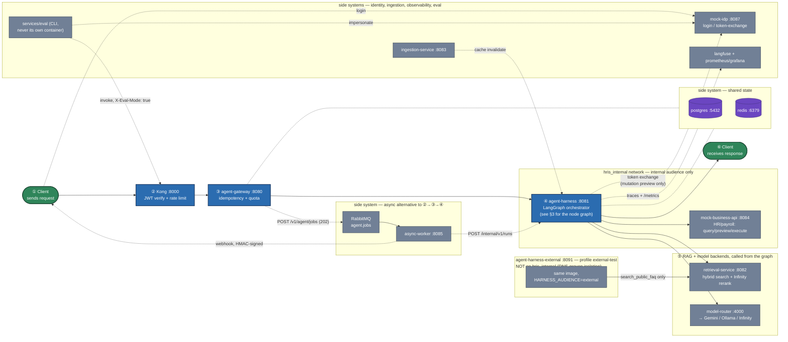
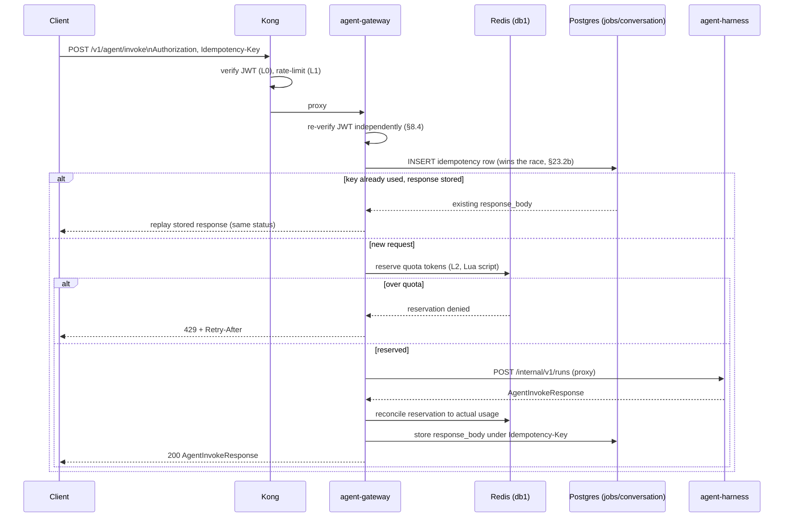
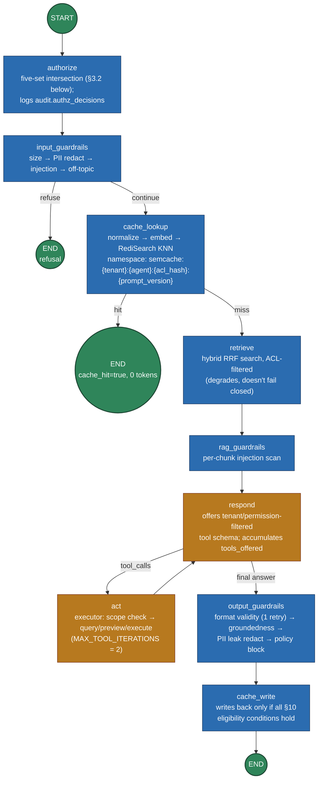
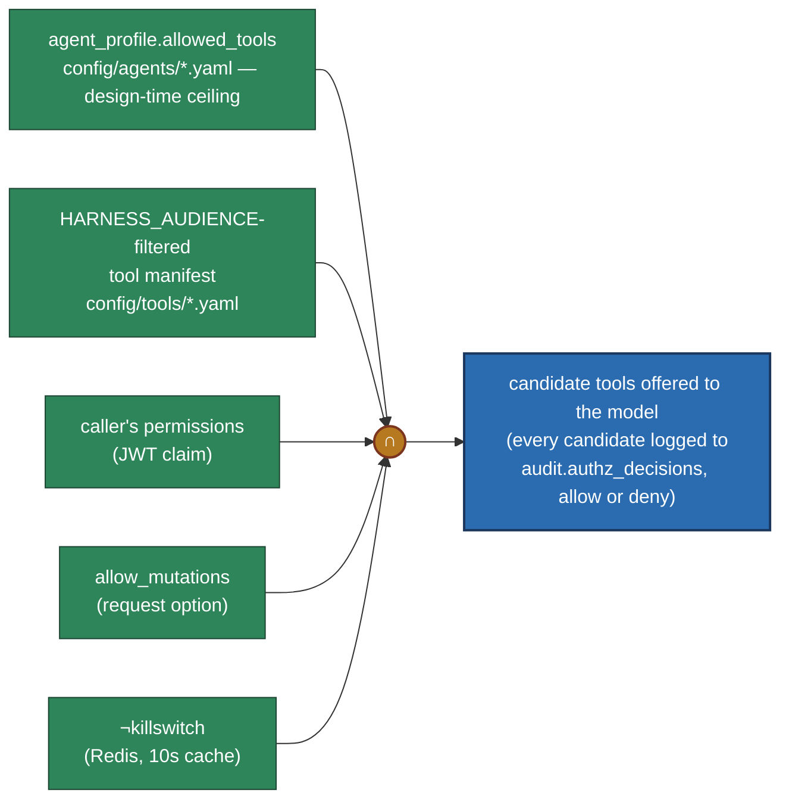
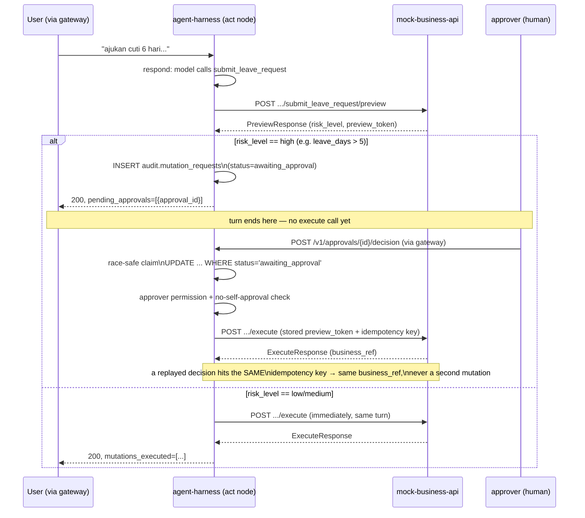
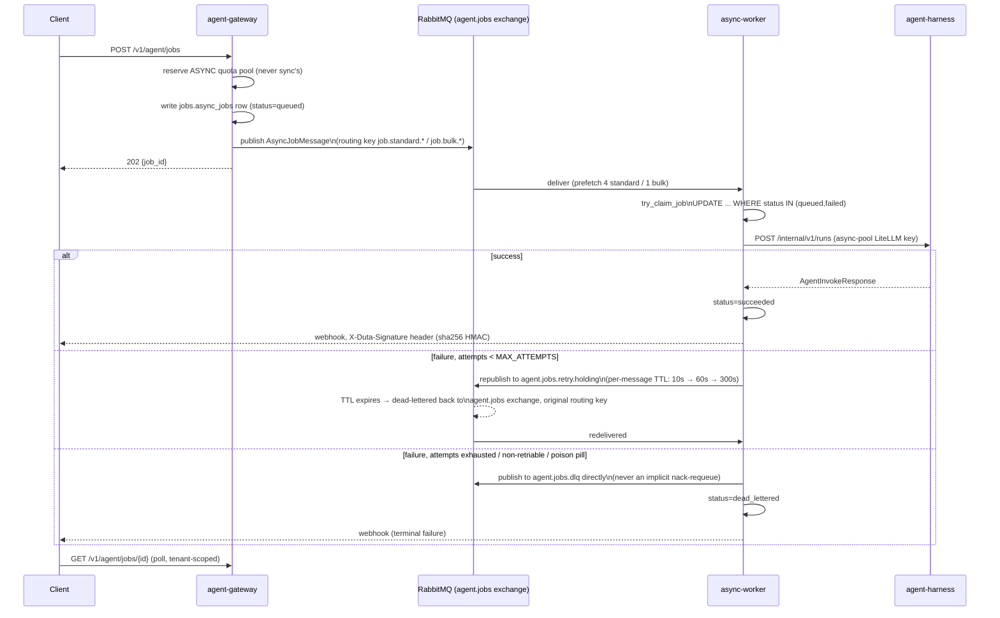
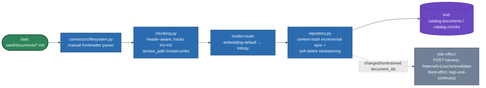
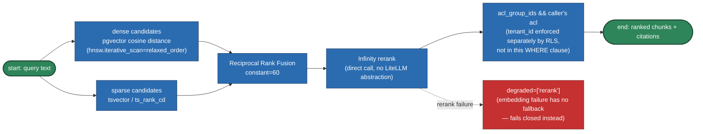
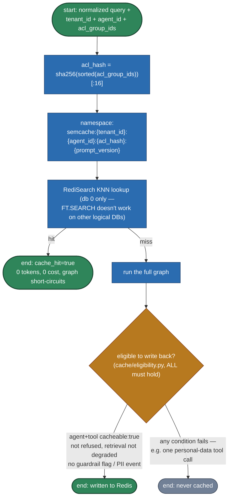
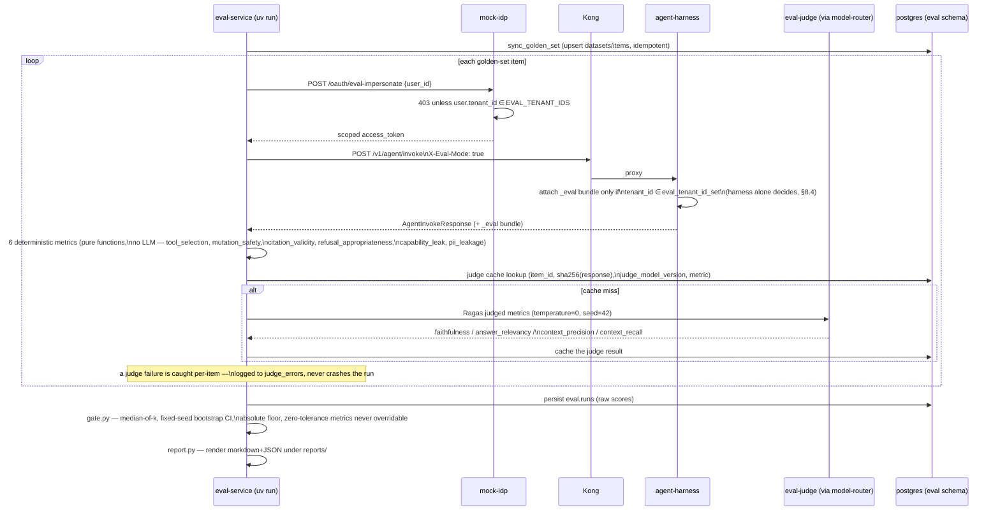

# Architecture

Visual companion to [docs/SPEC.md](SPEC.md) and [CLAUDE.md](../CLAUDE.md). One combined system
topology diagram, then one flow diagram per major interaction. All diagrams reflect the code as of
M8 (see [README.md](../README.md)'s milestone table) — service names, ports, queue names, and
graph node names are taken directly from `deploy/docker-compose.yml`,
`services/harness/src/harness/graph/build.py`, and `packages/contracts/src/contracts/jobs.py`, not
re-derived from the spec's prose.

## 1. System topology

Every service, every datastore, the message broker, the model backends, and — in the same
diagram, per §21/ADR-011 — the internal/external audience network split. `agent-harness-external`
is not part of the default `make up` stack (`--profile external-test`); it's included here because
it's the thing that makes the audience split a *network* fact, not just a policy one:
`agent-harness-external` is never joined to `hris_internal`, so it cannot resolve
`mock-business-api` at the DNS level, regardless of what any policy engine decides.

The numbers (**①**–**⑥**) mark the one synchronous request's path through the system, in order —
follow those first. Everything else on the diagram (async, identity, ingestion, observability,
eval) is a **side system**, drawn with thin dotted connectors so it never competes with that main
path for attention.

Notes on reading this diagram:

- **Green** = the request's entry/exit. **Blue** = the two services on the request's own critical
  path besides Kong. **Grey** = everything else the graph calls out to. **Purple** = durable state.
- **Solid arrows** trace the one synchronous request, in numbered order. **Dotted arrows** are
  side-band (login, webhooks, traces, metrics, token exchange, async) — the caller doesn't block
  its main response on them.
- `agent-harness` sits in `hris_internal` *and* `default` — it's the only orchestrator allowed to
  reach `mock-business-api`. `agent-harness-external` sits only in `default`; the box around each
  is the actual Docker network boundary, not a drawing convention.
- `services/eval` and the demo `curl` client are both just HTTP clients of the same public surface
  (Kong) — eval-service has no special network access, only a special mock-idp endpoint
  (`/oauth/eval-impersonate`) that itself re-checks the tenant server-side.

## 2. Gateway request lifecycle

Every `/v1/*` call through Kong goes through the same idempotency + quota shape before it ever
reaches harness.

The async twin (`POST /v1/agent/jobs`) is identical through the idempotency step, then reserves
against the **async** quota pool (never `sync`'s — §6) and publishes to RabbitMQ instead of calling
harness directly; §5's job flow diagram below picks up from there.

## 3. Harness: the LangGraph run

One `AgentState` flows through a fixed node graph, computed once per run (`authorize`, never
mid-loop) with a single bounded `respond ↔ act` loop.

Green circles are the graph's only entry/exit points — one `START`, three possible `END`s (early
refusal, a cache hit, or the normal path). The amber `respond ↔ act` pair is the only cycle in the
whole graph, bounded at two iterations.

## 3.2 Authorization: the five-set intersection (§22.1)

Computed once by the `authorize` node, held constant through the whole `respond ↔ act` loop —
never re-derived mid-turn.

The five green inputs are where the flow starts; the blue box on the right is where it ends.

A tool surviving this intersection is only offered to the model — `tools/executor.py` re-checks
membership again at *execution* time (§22.4's "pengecekan kedua"), and a `data_scope: self`
violation is rejected outright rather than silently corrected.

## 4. Tool-calling & the two-phase mutation contract (§5.3/§8.4)

Readonly tools (`get_leave_balance`) call `mock-business-api`'s `/query` directly and return in
the same turn. Mutation tools always preview first; only low/medium risk executes immediately.

## 5. Async job path (§5.9/§5.10)

## 6. Ingestion pipeline (§5.11)

Each document runs in its own `tenant_session` (§5.11) through this whole chain — one bad
document's error can't abort another document's insert in the same run.

## 7. Retrieval: hybrid search (§28.9)

## 8. Semantic cache (§10)

The one field that makes an ACL-gated RAG answer safe to share across users is `acl_hash` in the
namespace key — not a separate check layered on afterward.

## 9. Evaluation pipeline (§13)

`services/eval` is a CLI, never a container — it drives the already-running stack over the same
public surface a real client would use.

Zero-tolerance deterministic metrics (`mutation_safety`, `capability_leak`, `pii_leakage`) block
the gate on any nonzero count, with no override possible — everything else is a threshold that can
be overridden with two reviewers (§13.8's verdict table). Re-running `gate.py` against an
already-persisted `run_id` never re-invokes the LLM and produces a byte-identical verdict — the
literal §15 DoD, proven by `services/eval/tests/unit/test_gate.py` and live.

**A separate, parallel flow — `make eval-nightly-sample`** (§13.9) reads real production traces
back out of Langfuse's public API (`clients/langfuse.py`, never ClickHouse directly — same
"don't reach into another system's private storage" reasoning as boundary #2's own schema
isolation) instead of the golden set, scores each with a new hand-rolled `citation_support` judge
plus the two Ragas metrics that don't need a ground-truth `reference` (`faithfulness`,
`answer_relevancy` — `context_precision`/`context_recall` need one no production trace has), and
writes the lowest-scoring N to a markdown report for a human to read. It never writes to
`eval.items` or `seed/eval/golden_set.yaml` — §13.9's own text is explicit that curation must stay
manual, or the golden set's quality degrades silently over time.
